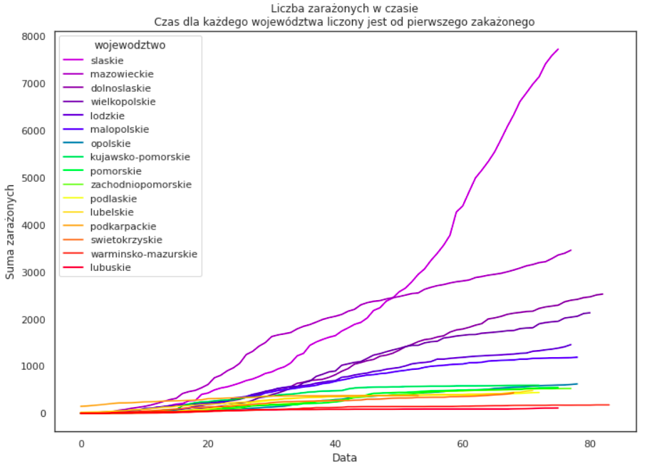

# O nas

::: notes
Jesteśmy studentami Politechniki Rzeszowskiej na kierunku Inżynieria i analiza
danych, a także członkami nowo stworzonego koła uczenia maszynowego. Chcemy
pokazać to, co udało nam się odkryć w trakcie realizacji pierwszego Hackathonu
realizowanego w naszym kole, a dotyczył on pandemii.
:::

[//]: # (Dodać logo koła naukowego)

# Nasz cel

::: notes
Naszym celem było znalezienie, reguł asocjacyjnych i ciekawych zależności w
danych z zachorwań, które docelowo miały nam posłużyć do lepszego zrozumienia
sposobu rozprzestrzeniania się koronawirusa SARS-COV-2 i przewidywania ilości
zachorowań.

Pokażemy, w jaki sposób pracowaliśmy, jakich technik używaliśmy i jak zdobyliśmy
dane, których używaliśmy. Mamy nadzieję, że są wśród was studenci, których
zainteresujemy naszą pracą i dołączą do naszego koła naukowego.
:::

# Dane

::: notes
Jeszcze, gdy zaczynaliśmy, liczba zachorowań nie przekraczała 500 osób
dziennie (był to okres od marca do maja 2020), wtedy kolejnymi falami określano
niewielkie z perspektywy czasu wzrosty zakażeń. 
:::

# Jak znaleźć źródła danych?

::: notes
To było pierwszym pytanie, jakie zadaliśmy sobie w naszym projekcie. Szczególnie
na początku pandemii dostęp do szczegółowych danych nie był tak prosty. Powodów
było kilka:

- na stronie ministerstwa publikowane były wyłącznie dane z danego dnia.
- publicznie dostępne dane dotyczące wielu krajów nie zawierały podziału na
  województwa.

A szczególnie interesowały nas dane z podziałem na województwa, ewentualnie na
jeszcze mniejsze jednostki podziału terytorialnego.
:::

# Źródła danych

::: notes
Na szczęście udało nam się znaleźć inne źródła, tj. strony tworzone przez ludzi,
którzy codziennie sami zbierali te dane i udostępniali je w formie wykresów.
Przykładem takiej strony jest <koronawirusunas.pl>. Dzięki uprzejmości jej
twórców udało nam się pobrać dane na niej zawarte i przeprowadzić wszystkie
analizy.

Do głównych źródeł danych zaliczyć możemy:

- IHME
- koronawirusunas.pl
- policja.pl
:::

# Techniki zbierania danych

::: notes
Główną techniką wykorzystywaną przez nas był web scraping, stworzyliśmy skrypty,
które (oczywiście za zgodą właścicieli portali) pobierały z nich bieżące dane. Z
kolei pozostałe dane były udostępnione publicznie w formie skompresowanych
plików, także aktualizowanych codziennie.
:::

## Dostęp do API

::: notes
Część danych była dostępna bezpośrednio z API, tzn. wysyłając zapytanie do
strony otrzymywaliśmy dane gotowe do przyjęcia przez program. Była to
sytuacja o tyle prostsza od scrapingu, że nie musieliśmy dodatkowo przetwarzać
tych danych.

Wśród danych dostępnych przez API były dane pogodowe, jednak bardzo ułatwiało
to pracę.

Niestety w tym roku Meteostat zaktualizował API do wersji drugiej, która jest
zupełnie niekompatybilna z poprzednią. Z tego powodu nasz kod bez drognych
modyfikacji nie działa aktualnie, a z braku czasu jeszcze go nie naprawiliśmy.
Wszystkie analizy oparte są na danych, które zapisaliśmy w trakcie pierwotnego
pisania.
:::

## Użycie API

API używamy do pobierania danych pogodowych. Pochodzą one z
[Meteostatu](https://meteostat.net/en/sources), a pobieramy je dla Warszawy.

---

API udostępnia takie dane jak temperatura (średnia, max, min), dane o wietrze,
nasłonecznieniu, opadach i ciśnieniu - spróbowaliśmy znaleźć korelację między
tymi danymi, a zachorowaniami (niekoniecznie natychmiastową). Dla naszego
użytku to było najłatwiejsze rozwiązanie, ponieważ Meteostat dostarcza dobre
jakościowo dane bez dodatkowych opłat w przeciwieństwie do usług takich jak
AccuWeather. Jako miejsce pobrania danych wybraliśmy Warszawę ze względu na
bycie - mniej więcej - w centrum kraju. Dodatkowym atutem jest też to, że
jako pojedyncze miasto jest największa w Polsce, więc można się było tam
spodziewać najlepszego odwzorowania trendów w kraju. Drugim dobrym strzałem
mógł się okazać Śląsk ze względu na duże zagęszczenie ludności i fakt, że
cała aglomeracja przewyższa populacją Warszawę. 

# Jak pracowaliśmy z danymi

::: notes
Te dane musiały zostac sprowadzone do wspólnego formatu, tak aby wszystkie
stworzone wykresy i analizy można było odtwarzać natychmiast po aktualizacji
danych, ponieważ te zmieniały się z dnia na dzień wraz z rozwojem pandemii. Do
tego wykorzystaliśmy pythona i Jupyterlab.
::: 

# Jak pracowaliśmy z danymi

::: notes
Z pomoca jupyterlab można stworzyć interaktywne notatniki, które działają krok
po kroku, jeden z nich służył wyłącznie do pobrania danych ze wszystkich źródeł
ich oczyszczenia i sprowadzenia do wspólnego formatu. Same analizy znalazły się
w osobnym notatniku, co umożliwiło nam zapanowanie nad projektem. Oczywiście
korzystanie z notatników też ma swoje wady, kolejne zmiany utrzymywane w
systemie kontroli wersji Git nie są czytalne.
:::

# Wnioski

::: notes
Z naszej analizy wynikło wówczas, że wzrost liczby zakażonych na tamten moment
wykazywał bardzo mocny trend wykładniczy, co jest zgodne z przewidywaniami. Co
ciekawe Trendu nie zmieniło wprowadzenie obostrzeń, chociaż nie jest to
równoznaczne z ich bezsensownością - trend wykładniczy jest bardzo podatny na
zmianę podstawy, a to właśnie nią manipulowały obostrzenia. W naszym wypadku
podstawą jest współczynnik reprodukcji wirusa, który dla wartości $r>1.0$ jest
bardzo niekorzystny i widocznie wzrostowy.
:::

## Czego się nauczyliśmy?

::: notes
Analiza tych danych pozwoliła nam na zapoznanie się z metodami przetwarzznia ich,
podstawami wizualizacji, a także znajdowania nowych źródeł. Bardzo dużą rolę
odegrało także oczyszczanie tych danych, ponieważ prawie wszystkie źródła
zawierały dane niepotrzebne, które w żaden sposób nie przyczyniają się do
jakichkolwiek znaczących wyników. Wykluczyliśmy także dane, które silnie
korelowały ze sobą, ponieważ mogły one zakłócić odbiór pozostałych statystyk.
:::

## Co innego zyskaliśmy?

::: notes
Nasze _badania_ przełożyły się poza tym wszystkim na dodatkowe punkty do
stypendium rektora, ponieważ były powiązane z innymi badaniami prowadzonymi na
PRz przez prof. Dominika Strzałkę. Dzięki temu mogliśmy także lepiej poznać się
z kolegami z roku, mimo sytuacji pandemicznej, ponieważ wymienialiśmy się
doświadczeniami i rozmawialiśmy na temat całego hackathonu.

Jest to o tyle ciekawe doświadczenie, że jest znacznie bardziej zbliżone do pracy
w faktycznym projekcie, ponieważ nie mieliśmy z góry określonego celu. Od
mentorów nie dostawaliśmy gotowych rozwiązań, a jedynie wskazówki czy dana metoda
wydaje się być odpowiednią dla danego typu danych.
:::