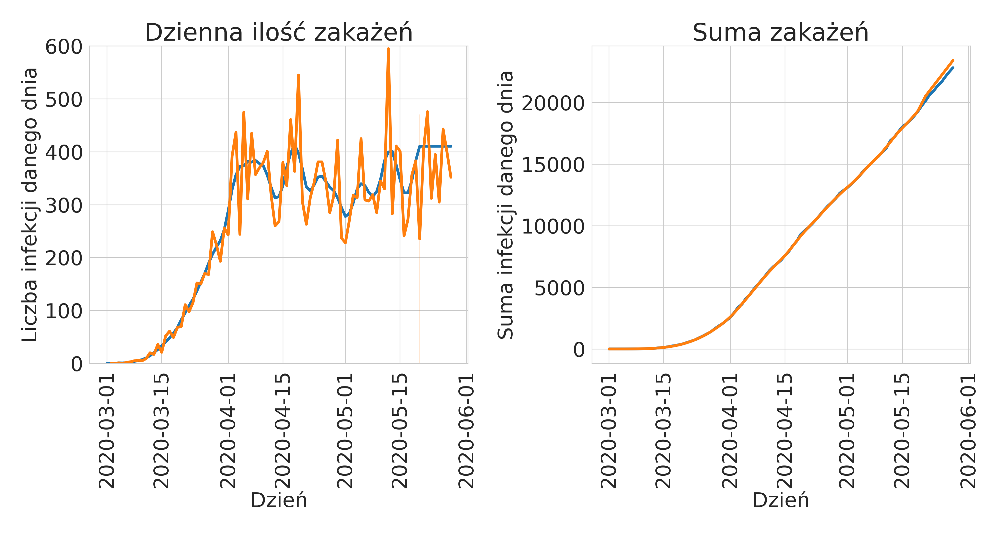

# O nas

::: notes 
Jesteśmy studentami Politechniki Rzeszowskiej na kierunku Inżynieria i
analiza danych, a także członkami nowo stworzonego koła uczenia maszynowego.
Chcemy pokazać to, co udało nam się odkryć w trakcie realizacji pierwszego
Hackathonu realizowanego w naszym kole.
:::

# Nasz cel

Znalezienie reguł kierujących rozwojem pandemii

::: notes 
Naszym celem było znalezienie, reguł asocjacyjnych i ciekawych
zależności w danych z zachorowań, które docelowo miały nam posłużyć do lepszego
zrozumienia sposobu rozprzestrzeniania się koronawirusa SARS-COV-2 i
przewidywania ilości zachorowań.

Pokażemy, w jaki sposób pracowaliśmy, jakich technik używaliśmy i jak zdobyliśmy
dane, których używaliśmy. Mamy nadzieję, że są wśród was studenci, których
zainteresujemy naszą pracą i dołączą do naszego koła naukowego.
:::

# Dane

::: notes 
Tak wyglądały pierwsze dane, do których uzyskaliśmy dostęp. Jeszcze,
gdy zaczynaliśmy, liczba zachorowań nie przekraczała 500 osób dziennie (był to
okres od marca do maja 2020). Na wykresie widać pierwszy problem, który
napotkaliśmy: dane nie były aktualizowane codziennie. Pochodziły ze strony 
healthdata.org, a publikowane były w formie raportów wraz z danymi.
:::

# Problemy z oficjalnymi źródłami danych

Dwa główne problemy:

- Na stronie ministerstwa publikowane były wyłącznie dane z danego dnia.
- Publicznie dostępne dane dotyczące wielu krajów nie zawierały podziału na
  województwa.
  

::: notes 
To było pierwsze pytanie, jakie zadaliśmy sobie w naszym projekcie.
Szczególnie na początku pandemii dostęp do szczegółowych danych nie był tak
prosty. Powodów było kilka:

- na stronie ministerstwa publikowane były wyłącznie dane z danego dnia.
- publicznie dostępne dane dotyczące wielu krajów nie zawierały podziału na
  województwa.

A szczególnie interesowały nas dane z podziałem na województwa, ewentualnie na
jeszcze mniejsze jednostki podziału terytorialnego.
:::

# Źródła danych

Do głównych źródeł danych zaliczyć możemy:

- IHME
- koronawirusunas.pl
- policja.pl

::: notes
Na szczęście udało nam się znaleźć inne źródła, tj. strony tworzone przez ludzi,
którzy codziennie sami zbierali te dane i udostępniali je w formie wykresów.
Przykładem takiej strony jest <koronawirusunas.pl>. Dzięki uprzejmości jej
twórców udało nam się pobrać dane na niej zawarte i przeprowadzić wszystkie
analizy. Z czystej ciekawości pobraliśmy też raporty policji na temat osób 
zatrzymanych i przeprowadzanych interwencji, gdyż podejrzewaliśmy, iż mogłyby 
być skorelowane z mobilnością Polaków.
:::

# Techniki zbierania danych
BeautifulSoup4 + Python

::: notes
Główną techniką wykorzystywaną przez nas wył web scraping, stworzyliśmy skrypty,
które (oczywiście za zgodą właścicieli portali) pobierały z nich bieżące dane. Z
kolei pozostałe dane były udostępnione publicznie w formie skompresowanych
plików.
:::

# Jak pracowaliśmy z danymi

::: notes 
Te dane musiały zostac sprowadzone do wspólnego formatu, tak aby
wszystkie stworzone wykresy i analizy można było odtwarzać natychmiast po
aktualizacji danych, ponieważ te zmieniały się z dnia na dzień wraz z rozwojem
pandemii. Do tego wykorzystaliśmy pythona i Jupyterlab. Z pomoca Jupyterlab
można stworzyć interaktywne notatniki, które działają krok po kroku, jeden z
nich służył wyłącznie do pobrania danych ze wszystkich źródeł ich oczyszczenia i
sprowadzenia do wspólnego formatu. Same analizy znalazły się w osobnym
notatniku, co umożliwiło nam zapanowanie nad projektem. Oczywiście korzystanie z
notatników też ma swoje wady, kolejne zmiany utrzymywane w systemie kontroli
wersji Git nie są czytelne. 
:::

# Analiza zebranych danych

::: notes
Przejdziemy teraz do analizy zebranych danych. Do najważniejszych wykresów 
należą te dotyczące ilości zakażeń z danego dnia. W naszym przypadku pochodziły
one z dwóch źródeł IHME oraz strony koronawirusunas.pl. Tak prezentuje się 
porównanie tych danych. Już na pierwszy rzut oka widać, że dane te się różnią.
Dlatego ważne jest sprawdzanie ich dokładnych opisów u źródła. 

W naszym przypadku dane ze strony koronawirusunas.pl to dane brane bezpośrednio
z ministerstwa i są to dane dzienne. Natomiast dane z IHME opisywał raport, w
którym nie było mowy o uśrednianiu danych, a na takie wyglądają. Ponadto na
dzień zebrania tych danych IHME nie opublikowało nowego raportu i dane urywają
się na 19 Maja 2020 roku - kolejne dni to naiwne przewidywanie oparte o 
średnią z dni poprzednich.
:::

# Analiza danych

::: notes
Mając już dane o ilości zakażeń, postanowiliśmy się zastanowić nad tym, jak na 
podstawie tych danych rząd podejmował decyzje o wprowadzaniu kolejnych 
obostrzeń oraz ich łagodzeniu. W tym celu przeglądnęliśmy Internet w 
poszukiwaniu dat wprowadzenia obostrzeń. Dane podzieliliśmy na kolejne etapy 
i tak oto prezentują się wykresy. 

W skali of fioletu po czerwień jest czas, zatem odczytać możemy go w 
następujący sposób: 

- Mobilność polaków na początku pandemii znacznie spadła i utrzymywała się 
  tak przez około dwa tygodnie, po tym czasie zaczęła wzrastać.
  
- Liczba infekcji stale rosła, po 3-4 tygodniach ustabilizowała się na 
  poziomie 350 zakażeń dziennie
  
Zatem: pomimo wzrostu mobilności polaków zakażenia ustabilizowały się na 
pewnym poziomie. Mogło to być spowodowane faktem, iż wprowadzone obostrzenia 
zaczęły przynosić skutki.

Wykres ten staje się o wiele ciekawszy, jeżeli przypomnimy sobie jak 
wyglądały  dane z poszczególnych województw.
:::
