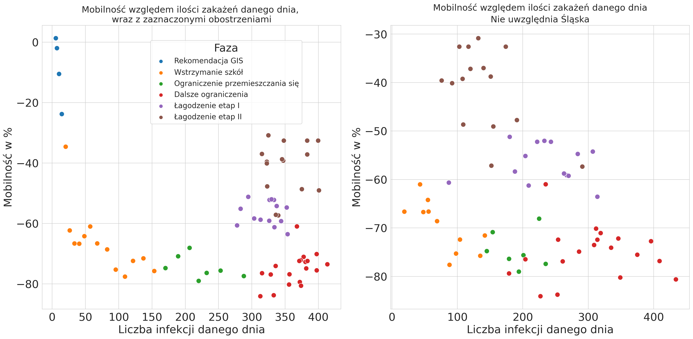
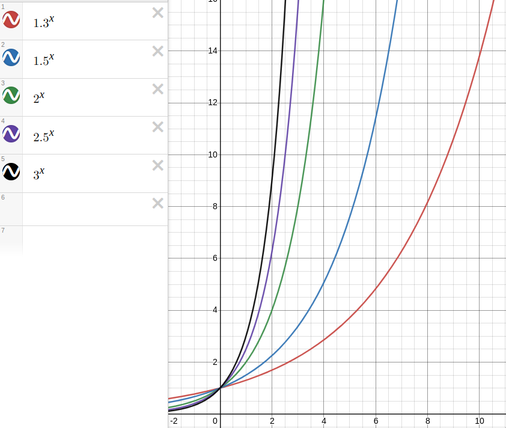

# O nas

::: notes 
1. Inżynieria i analiza danych
2. Koło
  - założenie
  - dlaczego je założyliśmy
  - pierwsze działania
:::

# Nasz cel

Znalezienie reguł kierujących rozwojem pandemii

::: notes 
1. Znalezienie:
  - reguł asocjacyjnych
  - ciekawych zależności
2. Lepsze zrozumienie rozprzestrzeniania się wirusa
3. Przewidywanie liczby zachorowań
4. Jak pracowaliśmy
5. jak zdobyliśmy dane
6. Jak trafią na naszą uczelnię, to zapraszamy
:::

# Dane

---

{width=90%}

::: notes 
Tak wyglądały pierwsze dane, do których uzyskaliśmy dostęp. Jeszcze,
gdy zaczynaliśmy, liczba zachorowań nie przekraczała 500 osób dziennie (był to
okres od marca do maja 2020). Na wykresie widać pierwszy problem, który
napotkaliśmy: dane nie były aktualizowane codziennie. Pochodziły ze strony 
healthdata.org, a publikowane były w formie raportów wraz z danymi.
:::

# Problemy z oficjalnymi źródłami danych

---

Dwa główne problemy:

>- Na stronie ministerstwa publikowane były wyłącznie dane z danego dnia.
>- Publicznie dostępne dane dotyczące wielu krajów nie zawierały podziału na
  województwa.
  
---

{width=90%}

::: notes 
To było pierwsze pytanie, jakie zadaliśmy sobie w naszym projekcie.
Szczególnie na początku pandemii dostęp do szczegółowych danych nie był tak
prosty. Powodów było kilka:

- na stronie ministerstwa publikowane były wyłącznie dane z danego dnia.
- publicznie dostępne dane dotyczące wielu krajów nie zawierały podziału na
  województwa.

A szczególnie interesowały nas dane z podziałem na województwa, ewentualnie na
jeszcze mniejsze jednostki podziału terytorialnego.
:::

# Źródła danych

Do głównych źródeł danych zaliczyć możemy:

>- IHME
>- koronawirusunas.pl
>- policja.pl

::: notes
Na szczęście udało nam się znaleźć inne źródła, tj. strony tworzone przez ludzi,
którzy codziennie sami zbierali te dane i udostępniali je w formie wykresów.
Przykładem takiej strony jest <koronawirusunas.pl>. Dzięki uprzejmości jej
twórców udało nam się pobrać dane na niej zawarte i przeprowadzić wszystkie
analizy. Z czystej ciekawości pobraliśmy też raporty policji na temat osób 
zatrzymanych i przeprowadzanych interwencji, gdyż podejrzewaliśmy, iż mogłyby 
być skorelowane z mobilnością Polaków.
:::

# Techniki zbierania danych

---

{width=40%}
{width=30%}

Python 3 i BeautifulSoup4

::: notes
Główną techniką wykorzystywaną przez nas był web scraping, stworzyliśmy skrypty,
które (oczywiście za zgodą właścicieli portali) pobierały z nich bieżące dane. Z
kolei pozostałe dane były udostępnione publicznie w formie skompresowanych
plików.
:::

# Dostęp do API

::: notes
Część danych była dostępna bezpośrednio z API, tzn. wysyłając zapytanie do
strony otrzymywaliśmy dane gotowe do przyjęcia przez program. Była to
sytuacja o tyle prostsza od scrapingu, że nie musieliśmy dodatkowo przetwarzać
tych danych.

Wśród danych dostępnych przez API były dane pogodowe, jednak bardzo ułatwiało
to pracę.

Niestety w tym roku Meteostat zaktualizował API do wersji drugiej, która jest
zupełnie niekompatybilna z poprzednią. Z tego powodu nasz kod bez drognych
modyfikacji nie działa aktualnie, a z braku czasu jeszcze go nie naprawiliśmy.
Wszystkie analizy oparte są na danych, które zapisaliśmy w trakcie pierwotnego
pisania.
:::

## Użycie API

API używamy do pobierania danych pogodowych. Pochodzą one z
[Meteostatu](https://meteostat.net/en/sources), a pobieramy je dla Warszawy.

::: notes
API udostępnia takie dane jak temperatura (średnia, max, min), dane o wietrze,
nasłonecznieniu, opadach i ciśnieniu - spróbowaliśmy znaleźć korelację między
tymi danymi, a zachorowaniami (niekoniecznie natychmiastową). Dla naszego
użytku to było najłatwiejsze rozwiązanie, ponieważ Meteostat dostarcza dobre
jakościowo dane bez dodatkowych opłat w przeciwieństwie do usług takich jak
AccuWeather. Jako miejsce pobrania danych wybraliśmy Warszawę ze względu na
bycie - mniej więcej - w centrum kraju. Dodatkowym atutem jest też to, że
jako pojedyncze miasto jest największa w Polsce, więc można się było tam
spodziewać najlepszego odwzorowania trendów w kraju. Drugim dobrym strzałem
mógł się okazać Śląsk ze względu na duże zagęszczenie ludności i fakt, że
cała aglomeracja przewyższa populacją Warszawę. 
:::

# Jak pracowaliśmy z danymi?

---

{width=30% .fragment}

{width=100% .fragment}

::: notes 

Te dane musiały zostac sprowadzone do wspólnego formatu, tak aby
wszystkie stworzone wykresy i analizy można było odtwarzać natychmiast po
aktualizacji danych, ponieważ te zmieniały się z dnia na dzień wraz z rozwojem
pandemii. Do tego wykorzystaliśmy pythona i Jupyterlab. Z pomoca Jupyterlab
można stworzyć interaktywne notatniki, które działają krok po kroku, jeden z
nich służył wyłącznie do pobrania danych ze wszystkich źródeł ich oczyszczenia i
sprowadzenia do wspólnego formatu. Same analizy znalazły się w osobnym
notatniku, co umożliwiło nam zapanowanie nad projektem. Oczywiście korzystanie z
notatników też ma swoje wady, kolejne zmiany utrzymywane w systemie kontroli
wersji Git nie są czytelne. 

:::

# Analiza zebranych danych

---

{width=90%}

::: notes
Przejdziemy teraz do analizy zebranych danych. Do najważniejszych wykresów 
należą te dotyczące ilości zakażeń z danego dnia. W naszym przypadku pochodziły
one z dwóch źródeł IHME oraz strony koronawirusunas.pl. Tak prezentuje się 
porównanie tych danych. Już na pierwszy rzut oka widać, że dane te się różnią.
Dlatego ważne jest sprawdzanie ich dokładnych opisów u źródła. 

W naszym przypadku dane ze strony koronawirusunas.pl to dane brane bezpośrednio
z ministerstwa i są to dane dzienne. Natomiast dane z IHME opisywał raport, w
którym nie było mowy o uśrednianiu danych, a na takie wyglądają. Ponadto na
dzień zebrania tych danych IHME nie opublikowało nowego raportu i dane urywają
się na 19 Maja 2020 roku - kolejne dni to naiwne przewidywanie oparte o 
średnią z dni poprzednich.
:::

# Analiza danych

---

{width=60%}

::: notes

Mając już dane o ilości zakażeń, postanowiliśmy się zastanowić nad tym, jak na 
podstawie tych danych rząd podejmował decyzje o wprowadzaniu kolejnych 
obostrzeń oraz ich łagodzeniu. W tym celu przeglądnęliśmy Internet w 
poszukiwaniu dat wprowadzenia obostrzeń. Dane podzieliliśmy na kolejne etapy 
i tak oto prezentują się wykresy. 

W skali of fioletu po czerwień jest czas, zatem odczytać możemy go w 
następujący sposób: 

- Mobilność polaków na początku pandemii znacznie spadła i utrzymywała się 
  tak przez około dwa tygodnie, po tym czasie zaczęła wzrastać.
  
- Liczba infekcji stale rosła, po 3-4 tygodniach ustabilizowała się na 
  poziomie 350 zakażeń dziennie.
  
:::

# Analiza danych

---

{width=60%}

::: notes
  
Zatem: pomimo wzrostu mobilności polaków zakażenia ustabilizowały się na 
pewnym poziomie. Mogło to być spowodowane faktem, iż wprowadzone obostrzenia 
zaczęły przynosić skutki. 

Po naniesieniu dat z poszczególnymi obostrzeniami i rozporządzeniami to ta 
hipoteza zdaje się prawdziwa.

Wykres ten staje się o wiele ciekawszy, jeżeli przypomnimy sobie jak, 
wyglądały dane z poszczególnych województw.

:::

<!--  -->

# Analiza danych - wykres województwa

---

{width=90%}

::: notes

Tutaj zdecydowanie wyróżnia się województwo śląskie, które w tym czasie 
notowało najwięcej zakażeń. Ponadto suma zakażeń gwałtownie rosła. 
Potraktowaliśmy to województwo jako odstające od pozostałych.

:::

# Analiza danych - bez śląska

---

::: notes

Usunięcie odstających danych dało ciekawy efekt, liczba zakażeń w 
pozostałych województwach maleje. Stąd też prawdopodobnie decyzje o 
łagodzeniu obostrzeń w kraju. Nie wliczając śląska, wraz ze wzrostem mobilności 
nie rosła ilość zakażeń.

:::

# Wnioski

::: notes

Z naszej analizy wynikło wówczas, że wzrost liczby zakażonych na tamten moment
wykazywał bardzo mocny trend wykładniczy, co jest zgodne z przewidywaniami. Co
ciekawe Trendu nie zmieniło wprowadzenie obostrzeń, chociaż nie jest to
równoznaczne z ich bezsensownością - trend wykładniczy jest bardzo podatny na
zmianę podstawy, a to właśnie nią manipulowały obostrzenia. W naszym wypadku
podstawą jest współczynnik reprodukcji wirusa, który dla wartości $r>1.0$ jest
bardzo niekorzystny i widocznie wzrostowy.

:::

---

{width=60%}

# Czego się nauczyliśmy?

::: notes

Analiza tych danych pozwoliła nam na zapoznanie się z metodami przetwarzania ich,
podstawami wizualizacji, a także znajdowania nowych źródeł. Bardzo dużą rolę
odegrało także oczyszczanie tych danych, ponieważ prawie wszystkie źródła
zawierały dane niepotrzebne, które w żaden sposób nie przyczyniają się do
jakichkolwiek znaczących wyników. Wykluczyliśmy także dane, które silnie
korelowały ze sobą, ponieważ mogły one zakłócić odbiór pozostałych statystyk.

:::

# Co innego zyskaliśmy?

::: notes

Nasze _badania_ przełożyły się poza tym wszystkim na dodatkowe punkty do
stypendium rektora, ponieważ były powiązane z innymi badaniami prowadzonymi na
PRz przez prof. Dominika Strzałkę. Dzięki temu mogliśmy także lepiej poznać się
z kolegami z roku, mimo sytuacji pandemicznej, ponieważ wymienialiśmy się
doświadczeniami i rozmawialiśmy na temat całego hackathonu.

Jest to o tyle ciekawe doświadczenie, że jest znacznie bardziej zbliżone do pracy
w faktycznym projekcie, ponieważ nie mieliśmy z góry określonego celu. Od
mentorów nie dostawaliśmy gotowych rozwiązań, a jedynie wskazówki czy dana metoda
wydaje się być odpowiednią dla danego typu danych.

:::

---

{width=90%}

# Dziękujemy za uwagę
