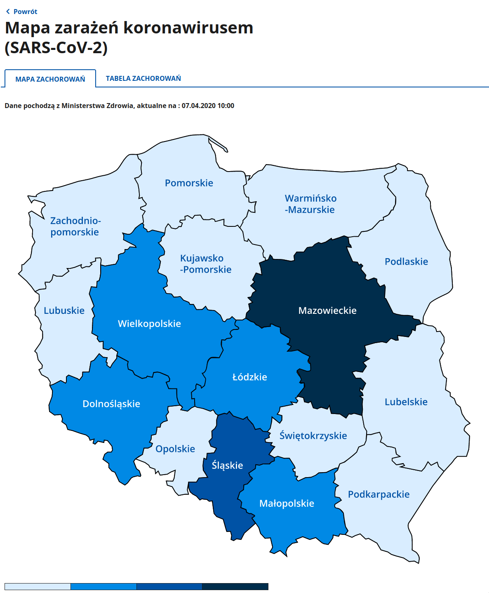
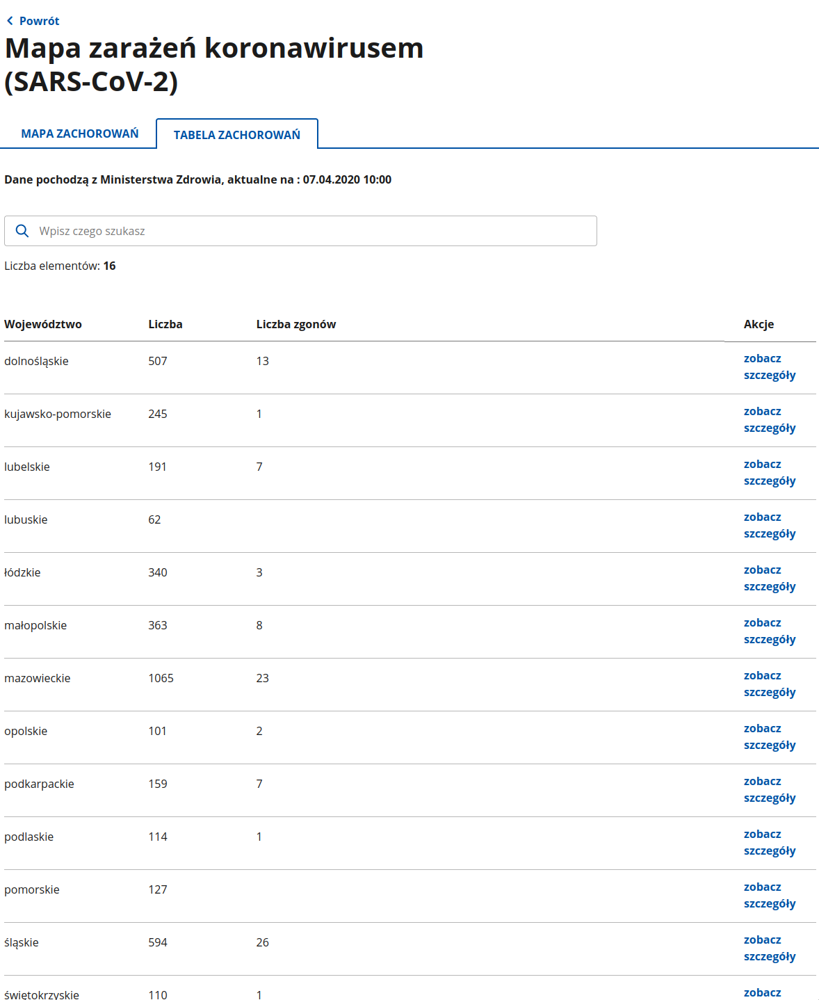
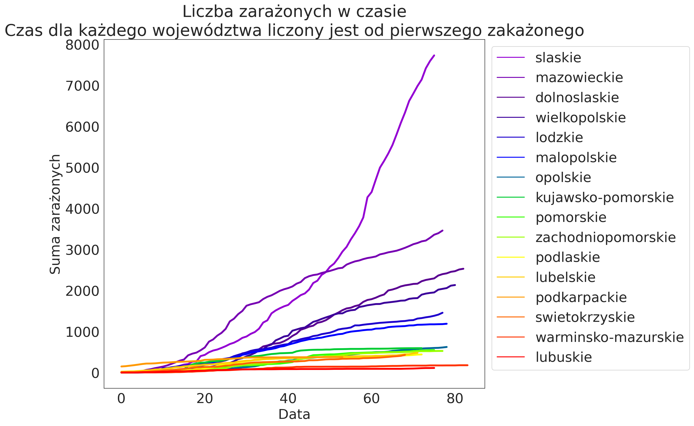
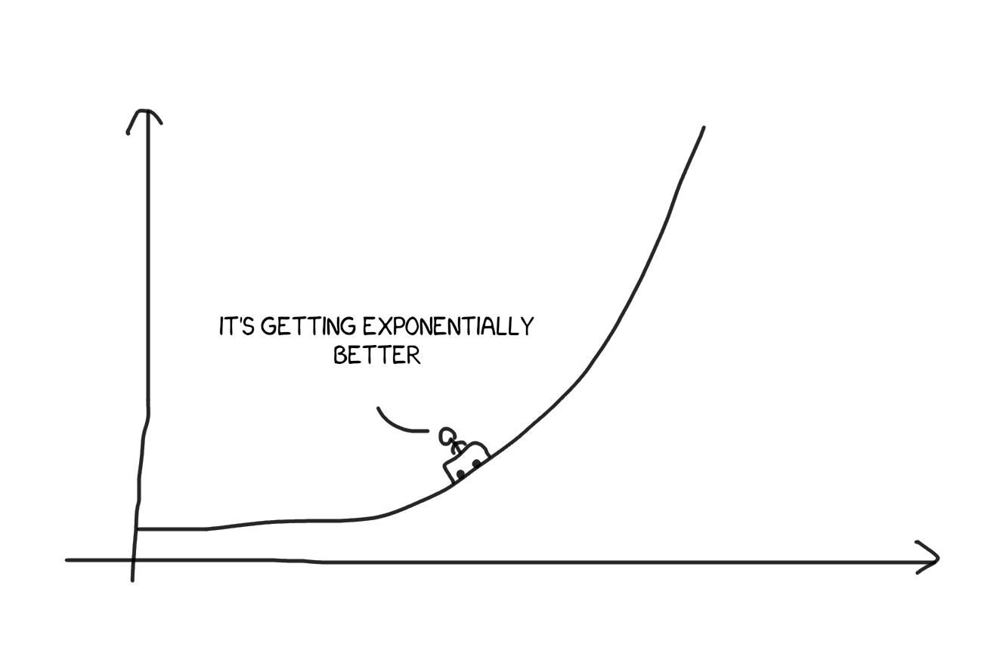

# O nas

::: notes 
1. Inżynieria i analiza danych
2. Robione w ramach nowo założonego koła (Hackathon)
:::

# Nasz cel

Znalezienie reguł kierujących rozwojem pandemii

::: notes 
1. Znalezienie:
    - reguł asocjacyjnych
    - ciekawych zależności
2. Lepsze zrozumienie rozprzestrzeniania się wirusa
3. Przewidywanie liczby zachorowań
:::

# Dane

---

Do głównych źródeł danych zaliczyć możemy:

>- IHME
>- koronawirusunas.pl
>- policja.pl

::: notes
1. Znaleźliśmy dane udostępniane przez pasjonatów
2. Sprawdzenie korelacji między interwencjami policji, a mobilnością
3. Było <500 zachorowań/dzień
4. Marzec-Maj 2020
5. Brak codziennych aktualizacji
6. Dane z healthdata.org
7. publikowane były jako raporty z danymi
:::

# Dlaczego nie dane rządowe?

---

Dwa główne problemy:

>- Na stronie ministerstwa publikowane były wyłącznie dane z danego dnia.
>- Publicznie dostępne dane dotyczące wielu krajów nie zawierały podziału na
  województwa.
  
::: notes
1. Dane jedynie za dzień poprzedni
2. Brak granularności w danych (jedynie per kraj)
:::

---

  {width=40%}

  {width=40% .fragment}

::: notes
1. Kiepskie
2. Dostępne jedynie za poprzedni dzień
3. Niereguralnie publikowane
:::

# Techniki zbierania danych

---

{width=60%}

{width=110%}

::: notes
1. Python jako język główny
2. Głównie web scraping (BS4)
    - istnienie innych frameworków, np. scrapy
    - wspomnienie, że bardziej znamy bs4
:::

# API

::: notes
1. Dane były dostępne w API
2. Dane pogodowe
3. Aktualizacja API meteostatu
4. Potrzeba aktualizacji
:::

---

API używamy do pobierania danych pogodowych. Pochodzą one z
[Meteostatu](https://meteostat.net/en/sources), a pobieramy je dla Warszawy.

::: notes
1. Temperatura, wiatr, nasłonecznienie, opady, ciśnienie
2. Korelacja pogody z zachorowaniami (z opóźnieniem)
3. Wysoka jakość danych
4. Brak opłat
5. Warszawa jako duże miasto w centrum kraju
:::

# Jak pracowaliśmy z danymi?

---

{width=30%}

{width=100% .fragment}

::: notes 
1. Sprowadzenie danych do wspólnego formatu
2. Wykorzystanie jupyter lab
3. Interaktywne notatniki
4. Osobne notatniki na pobieranie i analizę
5. Trzymanie zmian w gicie
:::

# Analiza danych

---

{width=90%}

::: notes
1. Ilość zakażeń z dnia (IHME/koronawirusunas)
2. Różnice w danych
3. koronawirusunas to dane z ministerstwa
4. IHME raport bez uśredniania (?)
5. Brak nowego raportu po 19 maja 2020 w IHME
:::

---

{width=80%}

::: notes

1. Zmiana liczby zakażeń i mobilności w czasie
2. Wprowadzanie kolejnych obostrzeń
3. Czas od fioletu do czerwieni
4. Spadek mobilności jedynie przez 2 tygodnie i późniejszy wzrost
5. Ustabilizowanie liczby zakażeń po 3-4 tygodniach (350/dzień)
:::

---

{width=80%}

::: notes
  
1. Wzorst mobilności nie wpłynął na liczbę zakażeń
2. Skuteczność obostrzeń
3. Widać na wykresie, że obostrzenia działały

:::

---

{width=90%}

::: notes

1. Specyficzny Śląsk
2. Znaczny wpływ na dane

:::

# A co gdyby...

# "Pozbyć się" śląska?

---

::: notes

1. Znaczna zmiana trendu po zignorowaniu Śląska
2. Luzowanie obostrzeń
3. Zwiększona mobilność nie powoduje wzorstu liczby zakażeń

:::

# Wnioski

::: notes

1. Widoczny trend wykładniczy
2. Brak zmiany w trendzie niezależnie od obostrzeń
3. Trend wykładniczy i wrażliwość na zmianę podstawy
4. Współczynnik reprodukcji podstawą funkcji wykładniczej

:::

---

{width=60%}

# Czego się nauczyliśmy?

::: notes

1. Poznanie metod:
    - przetwarzania
    - wizualizacji
2. Sposoby na szukanie nowych danych
3. Sposoby oczyszczania danych
4. Wykluczanie danych silnie skorelowanych

:::

# Co innego zyskaliśmy?

::: notes

1. Dodatkowe punkty do stypendium
2. Powiązanie z badaniami prof. Dominika Strzałki
3. Lepsze poznanie kolegów z roku mimo pandemii
4. Wymiana doświadczeń
5. Środowisko pracy odmienne od uczelnianych projektów
6. Wyznaczanie własnych celów
7. Radzenie sobie z sytuacjami, gdzie nikt nie mógł nam w 100% pomóc

:::

---

{width=90%}

# Repozytorium

{width=40%}

# Dziękujemy za uwagę

::: notes
***Pytania***
:::
